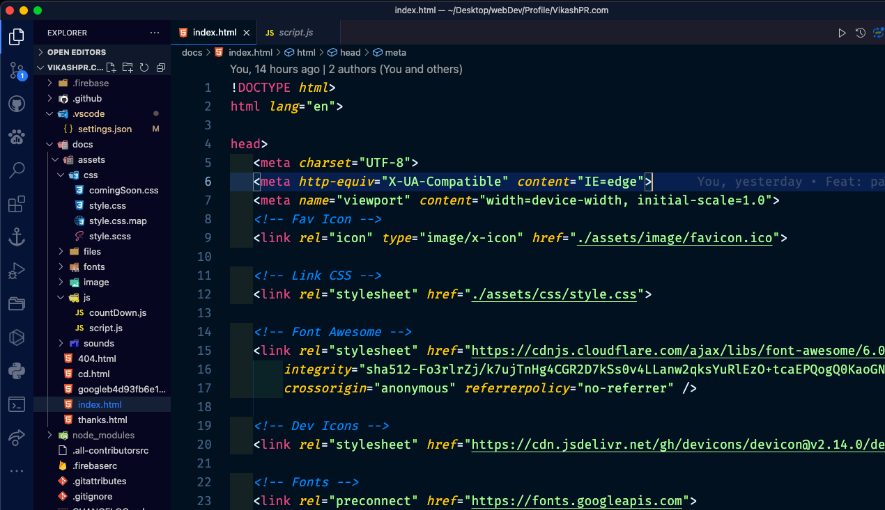

# VikashPR Dark Theme for VSCode

VikashPR Dark theme is a custom fork of Abbys  

# Installation

1. Open **Extensions** sidebar panel in VS Code. `View → Extensions`
2. Search for `VikashPR-Theme` - find the one by **Wes Bos** - there are a few other half-baked ones so make sure you have the right one!
3. Click **Install** to install it.
4. Code > Preferences > Color Theme > **VikashPR-Theme**

## Contributing

To work on the theme:

1. Clone this repo and open in VS Code
2. Open run `View → Run`
3. Click `Launch Extension`. This will open up another VS Code Editor
4. Make changes to `cobalt2.json`. You will see changes reflected in the other editor that opened in step 3.

If you are making a Pull Request, Please give me a screenshot of before/after!

## Deploying a new version

These are mostly notes for me.

1. Run `npm run release`
1. Next run `git push --follow-tags origin master && npm publish`
1.
